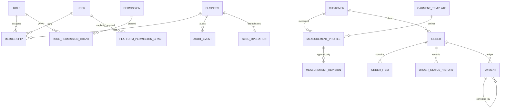

# Tailor Management System

TypeScript monorepo for tailoring businesses in Karachi. PostgreSQL is authoritative; the business admin is React/Vite, the mobile application uses Expo, and shared Zod contracts live in `packages/shared`. The MVP has no customer portal and no delivery/rider features.

## Implementation status

The migration from the starter prototype now includes a versioned Express API with authentication, membership-derived tenant authorization, customer/measurement/order/payment/report routes, append-only audit and payment records, a business admin flow, and platform APIs/screens for business onboarding/status, explicitly permissioned platform staff, audit and health. The Prisma schema and initial PostgreSQL migration are checked in. CI and focused tests are present.

**This is not production-ready.** Business employee/role administration, password-reset delivery, alteration-management UI, mobile sign-in and tailor workflows, SQLite outbox synchronization/conflict resolution, operational monitoring and recovery automation still need implementation and live deployment verification. The Expo app currently initializes local SQLite and shows network state; it does not yet sync queued business work. See [IMPLEMENTATION_PLAN.md](./IMPLEMENTATION_PLAN.md).

## Workspace

```text
backend/          Express API, Prisma schema, migration and seed
web/              Responsive React/Vite business operations
mobile/           Expo application shell and SQLite foundation
packages/shared/  TypeScript/Zod request contracts and helpers
docker-compose.yml
```

## Local setup

Requirements: Node.js 24 (Node 22.12+ is supported), npm 11, and Docker Compose.

1. Install the exact workspace versions from the root lockfile:

   ```sh
   npm ci
   ```

2. Create a local environment file and generate unique development-only secrets:

   ```sh
   cp .env.example .env
   openssl rand -hex 32
   ```

   Put the generated value in `ACCESS_TOKEN_SECRET`. PowerShell: `Copy-Item .env.example .env`.

3. Start PostgreSQL, generate the client and apply committed migrations:

   ```sh
   docker compose up -d postgres
   npm run db:generate
   npm run db:migrate
   ```

4. For local demo data, set four **development-only** values in `.env`:
   `SEED_OWNER_EMAIL`, `SEED_OWNER_PASSWORD`, `SEED_STAFF_EMAIL`,
   `SEED_STAFF_PASSWORD`, `SEED_PLATFORM_ADMIN_EMAIL`, and
   `SEED_PLATFORM_ADMIN_PASSWORD`. Use distinct email addresses, unique
   passwords of at least 16 characters (20 for the platform account) and no
   more than 72 UTF-8 bytes. Then run:

   ```sh
   npm run db:seed
   ```

   The seed refuses to run in production and never prints passwords. It does
   not reset an existing account's password; it refuses to repurpose accounts
   already attached to another role or business.

5. Start individual applications in separate terminals:

   ```sh
   npm run dev:api
   npm run dev:web
   npm run dev:mobile
   ```

   The API is on `http://localhost:5000`, the admin on `http://localhost:5173`,
   and Expo shows the local mobile runtime. API liveness is
   `GET /api/v1/health`; readiness (including the database) is
   `GET /api/v1/ready`. Set `VITE_API_BASE_URL` in the web environment when
   the API is hosted elsewhere.

## Android APK

The preview profile creates an installable APK with Expo Application Services
(EAS). From the repository root, authenticate with an Expo account, link the
mobile app to an EAS project once, and start the cloud build:

```sh
cd mobile
npx eas-cli login
npx eas-cli project:init
npx eas-cli build --platform android --profile preview
```

The EAS build URL provides the APK when the cloud build completes. A local
Android SDK is not required.

## Commands and tests

| Command | Purpose |
| --- | --- |
| `npm run db:generate` | Generate Prisma client |
| `npm run db:migrate` | Apply committed migrations |
| `npm run db:migrate:dev --workspace @tailor/api` | Create/apply a local development migration |
| `npm run db:seed` | Create configured local demo business/users/data |
| `npm run typecheck` | Type-check shared, API/seed, web and mobile |
| `npm test` | Run API, schema, authorization-middleware and financial unit tests |
| `npm run build` | Build shared package, API and web |
| `npm audit` | Audit the locked workspace dependency tree |

The tenant integration tests are skipped unless a disposable, migrated
PostgreSQL database is provided:

```sh
RUN_DB_TESTS=true npm test
```

`.github/workflows/ci.yml` configures PostgreSQL, applies the migration and
runs these tests alongside typecheck, build and dependency audit. This local
environment has no Docker executable, so the database migration deployment,
seed and live tenant integration tests could not be run here.

## Architecture and data boundaries



`businessId` is enforced in authenticated request context, not accepted as
authority from a client body or query. Every business controller adds that
scope to its data access; membership and role lookup happens server-side on
each authenticated request. Composite foreign keys reinforce tenant
boundaries for membership/role assignment, customer/order links, payments and
refresh-token membership. Cross-tenant identifiers return not-found rather
than revealing whether another tenant owns them.

Money is represented as PostgreSQL `DECIMAL(12,2)` and Prisma Decimal values.
Order snapshots preserve the selected dated measurement revision. Order
transitions are server-validated and version-checked. Payments are immutable
ledger entries, require an `Idempotency-Key`, and are committed with receipt
sequence and audit event in a serializable transaction. A correction is an
append-only reversal linked to its original payment; there is no delete-payment
endpoint.

The API uses `/api/v1`, Zod request parsing, cursor pagination and responses of
the form `{ "data": ... }`; failures return `{ "error": { "code", "message" },
"requestId" }`. Logs omit request bodies, query strings, authorization headers
and cookies.

## Roles and permissions

| Context | Intended authority | Enforcement |
| --- | --- | --- |
| Platform super admin | Platform-wide actions only where explicitly granted | `platformRole` is not sufficient by itself; every platform route checks a `PlatformPermissionGrant` |
| Business owner/manager | Own business, staff/roles, customers, work, ledger and reports | Active membership plus its business role grants |
| Tailor/staff | Assigned workflow permissions only | Same tenant membership checks; permission middleware denies by default |

The local seed grants its Owner role all current business permissions. The
Tailor role gets customer, measurement and order workflow permissions, not
payment, settings, reports or audit permissions. Platform grants are separate
from business grants. Platform staff can grant only permissions they
themselves hold. The local seed creates a demo platform super admin; it refuses
to run in production.

## Environment and security

See [.env.example](./.env.example). It contains only local examples. Never use
its database password or access-token example in any shared environment.
Production must supply `DATABASE_URL`, a generated `ACCESS_TOKEN_SECRET`,
explicit comma-separated HTTP(S) `CORS_ORIGINS`, and secret-manager storage.
`TRUST_PROXY_HOPS` defaults to zero; set it only to the known number of trusted
reverse-proxy hops.

| Variable | Use |
| --- | --- |
| `DATABASE_URL` | PostgreSQL connection for API, migrations and seed |
| `ACCESS_TOKEN_SECRET` | At least 32 characters; generate a unique value per environment |
| `CORS_ORIGINS` | Comma-separated allowed browser origins |
| `TRUST_PROXY_HOPS` | Number of trusted ingress proxy hops; keep `0` when directly exposed |
| `PORT`, `LOG_LEVEL`, `NODE_ENV` | API runtime configuration |
| `POSTGRES_USER`, `POSTGRES_PASSWORD` | Local Compose database only |
| `VITE_API_BASE_URL` | Web admin API origin; defaults to `http://localhost:5000` |
| `SEED_OWNER_*`, `SEED_STAFF_*`, `SEED_PLATFORM_ADMIN_*` | Required development-only demo identities; passwords are not checked in |
| `BOOTSTRAP_SUPER_ADMIN*` | One-time production bootstrap only; provide through a protected secret manager, then remove |

Passwords are bcrypt-hashed. Access JWTs expire after 15 minutes. Refresh
tokens are high-entropy opaque values stored only as SHA-256 hashes, rotated
on use, and revoked on logout or detected reuse. Clients must keep refresh
tokens in an appropriate secure store; the current web holds them in memory,
and the mobile secure-session flow is pending. Login/refresh and API requests
are rate-limited, JSON bodies are size-limited, CORS is allowlisted, Helmet
sets security headers, and error responses do not expose internal exceptions.
Authenticated users can change their password through
`POST /api/v1/auth/password/change`; refresh sessions are revoked as part of
that operation. Bcrypt input is capped at 72 UTF-8 bytes to avoid silent
truncation.

Threat considerations and remaining production controls:

- Rate limiting currently uses Express's in-process store. Configure a shared
  store before running multiple API replicas.
- Password reset tokens have a database model, but token delivery and reset
  endpoints require a configured email provider and are not implemented.
- Structured request logging is present; external error monitoring, alert
  routing, centralized log retention and secret rotation automation remain
  deployment tasks.
- Review proxy, CORS, TLS, database network policy, database roles and backup
  encryption for the actual deployment before exposing the API publicly.

## Deployment and recovery

Build with `npm ci`, `npm run typecheck`, `npm test`, `npm run build`, then run
`npm run db:migrate` as a controlled release step. Serve the compiled
`backend/dist` behind TLS and publish the built `web/dist` through a static
web host. Use managed PostgreSQL with private networking, encryption and
point-in-time recovery; never expose the database port publicly. Expo release
builds and signing are not configured.

To provision the first production platform super admin, apply migrations
first, then run the one-time bootstrap command from a protected environment
with `NODE_ENV=production`, `BOOTSTRAP_SUPER_ADMIN=true`,
`BOOTSTRAP_SUPER_ADMIN_EMAIL` and `BOOTSTRAP_SUPER_ADMIN_PASSWORD` supplied
through a secret manager:

```sh
npm run bootstrap:platform-admin --workspace @tailor/api
```

It requires a unique password of at least 20 characters, takes a PostgreSQL
advisory lock, refuses if any super admin already exists and writes an audit
event. Remove bootstrap variables immediately afterward.

For a local backup and restore drill:

```sh
docker compose exec -T postgres pg_dump -U tailor -d tailor -Fc > tailor.dump
# Restore into a separate, empty recovery database before considering it valid.
docker compose exec -T postgres createdb -U tailor tailor_restore
docker compose exec -T postgres pg_restore -U tailor -d tailor_restore < tailor.dump
```

Do not restore over the live database without a reviewed incident plan. Store
production backups encrypted and off-host, record retention/restore objectives,
and regularly verify point-in-time and full-restore procedures. Automated
production deployment, backup scheduling and recovery orchestration are not
included yet.
